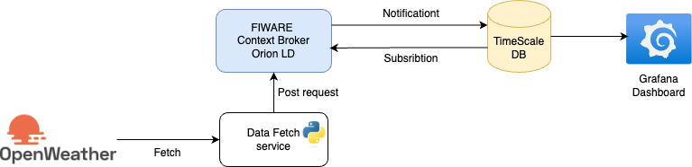

# Time-series analysis project: Weather data

## Architecture
This project highlevel architecture is like follows: 



## Implmentation: 

### Weather Data Fetcher and Context Broker Integration

This project fetches weather data from OpenWeatherMap API and sends it to a FIWARE Context Broker.

1. Create a .env file with your OpenWeatherMap API key:

```
OWM_API_KEY=your_api_key_here
OWM_URL=http://api.openweathermap.org/data/2.5/weather
````

2. Create a config/config.json file:
```json
{
  "city": "Hamburg",
  "context_broker_url": "http://localhost:1026/v2/entities",
  "context_broker_headers": {
    "Content-Type": "application/json",
    "Fiware-Service": "openweathermap",
    "Fiware-ServicePath": "/weather"
  }
}
```
3. Run the script:

```
python src/main.py
```

**Example Entity Data**

Here's an example of the entity data sent to the Context Broker:
```json
{
  "id": "Weather-Hamburg",
  "type": "WeatherObserved",
  "timestamp": {
    "value": "2025-02-26T14:30:00.000Z",
    "type": "DateTime"
  },
  "temperature": {
    "value": 8.18,
    "type": "Float"
  },
  "pressure": {
    "value": 1014,
    "type": "Integer"
  },
  "humidity": {
    "value": 86,
    "type": "Integer"
  },
  "wind_speed": {
    "value": 5.66,
    "type": "Float"
  },
  "clouds": {
    "value": 100,
    "type": "Integer"
  }
}
```

**Querying the Context Broker**

```bash
curl -X GET \
  'http://localhost:1026/v2/entities/Weather-Hamburg' \
  -H 'Accept: application/json' \
  -H 'Fiware-Service: openweathermap' \
  -H 'Fiware-ServicePath: /weather' | python -mjson.tool
```

This command will display the current weather data stored in the Context Broker for Hamburg.


