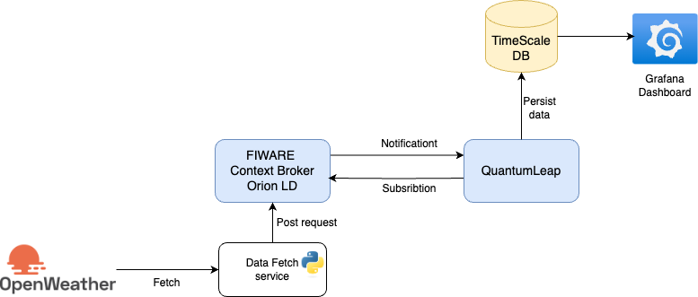

# Time-series analysis project: Weather data

## Architecture
This project highlevel architecture is like follows: 



## Usage 

To set up the environment for this project with all the services, we used Docker Compose. 

Run this command in the terminal at the root of the project: 

```shell
    docker compose up -d 
``` 

## Implmentation: 

### Weather Data Fetcher and Context Broker Integration

This project fetches weather data from OpenWeatherMap API and sends it to a FIWARE Context Broker.

1. Create a .env file with your OpenWeatherMap API key:

```
OWM_API_KEY=your_api_key_here
OWM_URL=http://api.openweathermap.org/data/2.5/weather
````

2. Create a config/config.json file:
```json
{
  "city": "Hamburg",
  "context_broker_url": "http://localhost:1026/v2/entities",
  "context_broker_headers": {
    "Content-Type": "application/json",
    "Fiware-Service": "openweathermap",
    "Fiware-ServicePath": "/weather"
  }
}
```
3. Run the script:

```
python src/main.py
```

**Example Entity Data**

Here's an example of the entity data sent to the Context Broker:
```json
{
  "id": "Weather-Hamburg",
  "type": "WeatherObserved",
  "timestamp": {
    "value": "2025-02-26T14:30:00.000Z",
    "type": "DateTime"
  },
  "temperature": {
    "value": 8.18,
    "type": "Float"
  },
  "pressure": {
    "value": 1014,
    "type": "Integer"
  },
  "humidity": {
    "value": 86,
    "type": "Integer"
  },
  "wind_speed": {
    "value": 5.66,
    "type": "Float"
  },
  "clouds": {
    "value": 100,
    "type": "Integer"
  }
}
```

**Querying the Context Broker**

```bash
curl -X GET \
  'http://localhost:1026/v2/entities/Weather-Hamburg' \
  -H 'Accept: application/json' \
  -H 'Fiware-Service: openstreetmap' \
  -H 'Fiware-ServicePath: /data' | python -mjson.tool
```

This command will display the current weather data stored in the Context Broker for Hamburg.

### TimescaleDB database set up 

**Database creation** 

Start fist by connecting to the PostgresSQL database via the terminal by running this command: 

```shell 
    docker compose exec timescaledb psql -U tsdbuser -d tsdb
```

This way you shoud be connected to the TimescaleDB database. 

To create the Database `weather_db` run the following command: 

```sql 
    CREATE DATABASE weather_db;
```
To check that the database is created run \l. 

**Create a table** 

Connect to the weather_db database:
```sql 
    \c weather_db
```

Create the weather_data table:

```sql
    CREATE TABLE weather_data (
    time        TIMESTAMPTZ       NOT NULL,
    entity_id   TEXT              NOT NULL,
    temperature DOUBLE PRECISION  NULL,
    pressure    INTEGER           NULL,
    humidity    INTEGER           NULL,
    wind_speed  DOUBLE PRECISION  NULL,
    clouds      INTEGER           NULL
);
```

The conversion of the weather_data table to a hypertable is done to optimize it for time-series data storage and querying. Hypertables in TimescaleDB offer several advantages over regular PostgreSQL tables for time-series data. 

```sql
SELECT create_hypertable('weather_data', by_range('time'));
```

To verify the table creation, you can list all tables in the current database:

```
    \dt
```

**Subscription mechnism to persist data in TimescaleDB**

To set up the subscription mechanism for persisting data in the created TimescaleDB database, follow these steps:

1. Create a subscription in Orion Context Broker to notify QuantumLeap of entity changes. This can be done with a POST request to Orion's /v2/subscriptions endpoint. The subscription should specify QuantumLeap's notify endpoint as the target URL.

```json
 curl -iX POST 'http://localhost:1026/v2/subscriptions' \
-H 'Content-Type: application/json' \
-H 'Fiware-Service: openiot' \
-H 'Fiware-ServicePath: /' \
-d '{
  "description": "Notify QuantumLeap of weather changes",
  "subject": {
    "entities": [
      {
        "idPattern": "Weather-.*",
        "type": "WeatherObserved"
      }
    ],
    "condition": {
      "attrs": ["temperature", "pressure", "humidity", "wind_speed", "clouds"]
    }
  },
  "notification": {
    "http": {
      "url": "http://quantumleap:8668/v2/notify"
    },
    "attrs": ["temperature", "pressure", "humidity", "wind_speed", "clouds", "timestamp"]
  },
  "throttling": 5
}'

```

This subscription will:

- Match entities with IDs starting with "Weather-" and type "WeatherObserved".

- Monitor changes in temperature, pressure, humidity, wind_speed, and clouds attributes.

- Notify QuantumLeap when changes occur, sending all specified attributes including the timestamp.

- Use a throttling value of 5 seconds to limit notification frequency.

To verify that the subscription was created, run this command: 

```shell
curl -X GET 'http://localhost:1026/v2/subscriptions' \
-H 'Fiware-Service: openiot' \
-H 'Fiware-ServicePath: /'
```

